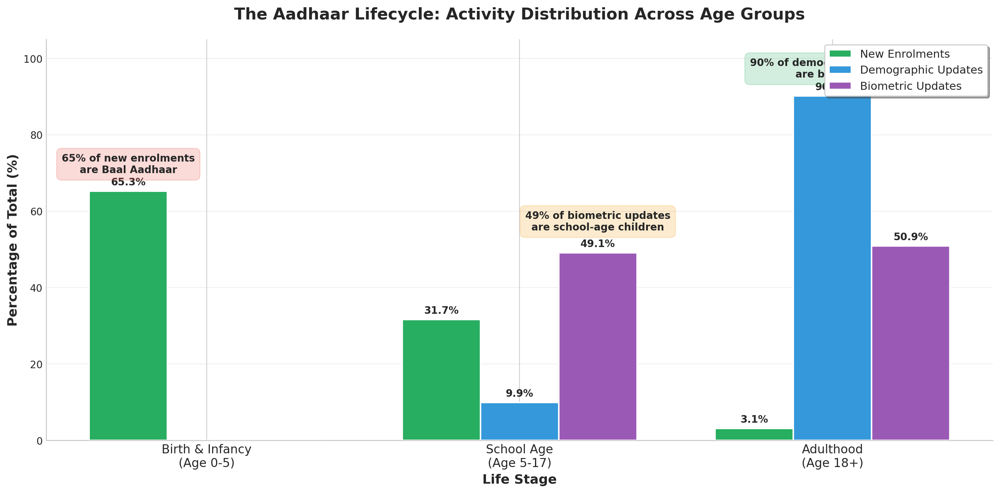
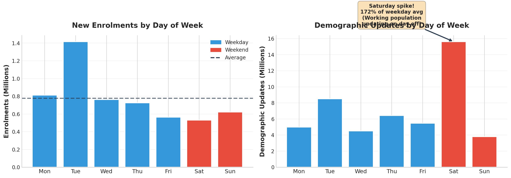

# The Aadhaar Lifecycle: Age-Driven Patterns in Enrolment and Updates

**UIDAI Online Hackathon on Data-Driven Innovation 2026**

Author: Siddhi Rohan  
Date: 11th January 2026

---

## Overview

This project analyzes approximately 5 million anonymized Aadhaar records to uncover societal trends in enrolment and update patterns. The central finding reveals a clear **Aadhaar Lifecycle** where different age groups interact with the system at predictable life stages.

### Key Findings

| Finding | Metric | Implication |
|---------|--------|-------------|
| Baal Aadhaar Dominance | 65% of enrolments are age 0-5 | Birth registration linkage effective |
| School-Driven Biometric Updates | 49% of bio updates are age 5-17 | Education schemes drive demand |
| Adult Demographic Updates | 90% of demo updates are age 18+ | Life event-driven patterns |
| Weekend Surge | 172% higher Saturday volume | Need extended weekend hours |
| Geographic Concentration | Top 3 states = 40% volume | Resource allocation priority |

---

## Repository Structure

```
aadhaar-lifecycle-analysis/
│
├── README.md                    # Project overview and documentation
├── requirements.txt             # Python dependencies
│
├── data/
│   └── README.md                # Data description (actual data not included)
│
├── src/
│   ├── data_loading.py          # Data loading and preprocessing
│   ├── analysis.py              # Core analysis functions
│   ├── visualizations.py        # Visualization generation
│   └── main.py                  # Main execution script
│
├── notebooks/
│   └── aadhaar_analysis.ipynb   # Jupyter notebook with full analysis
│
├── figures/
│   ├── fig1_volume_overview.png
│   ├── fig2_aadhaar_lifecycle.png
│   ├── fig3_weekly_patterns.png
│   ├── fig4_geographic.png
│   ├── fig5_monthly_trends.png
│   ├── fig6_update_ratios.png
│   ├── fig7_districts.png
│   ├── fig8_biometric_analysis.png
│   └── fig9_data_quality.png
│
└── report/
    ├── main.tex                 # LaTeX source
    └── UIDAI_Hackathon_Report.pdf
```

---

## Installation

```bash
# Clone the repository
git clone https://github.com/yourusername/aadhaar-lifecycle-analysis.git
cd aadhaar-lifecycle-analysis

# Install dependencies
pip install -r requirements.txt
```

---

## Usage

### Run the full analysis

```bash
python src/main.py
```

### Run individual components

```python
from src.data_loading import load_all_datasets
from src.analysis import calculate_lifecycle_metrics
from src.visualizations import create_all_figures

# Load data
enrol, demo, bio = load_all_datasets(data_path="data/")

# Run analysis
metrics = calculate_lifecycle_metrics(enrol, demo, bio)

# Generate figures
create_all_figures(enrol, demo, bio, output_path="figures/")
```

---

## Data Description

The analysis uses three anonymized datasets provided by UIDAI:

| Dataset | Records | Date Range | Columns |
|---------|---------|------------|---------|
| Enrolment | 1,005,889 | Mar-Dec 2025 | date, state, district, pincode, age_0_5, age_5_17, age_18_greater |
| Demographic Updates | 2,071,160 | Mar-Dec 2025 | date, state, district, pincode, demo_age_5_17, demo_age_17_plus |
| Biometric Updates | 1,860,884 | Mar-Dec 2025 | date, state, district, pincode, bio_age_5_17, bio_age_17_plus |

**Note:** The actual data files are not included in this repository as they are proprietary to UIDAI.

---

## Methodology

1. **Data Loading & Integration**: Concatenated multiple CSV files into unified DataFrames
2. **Data Cleaning**: Normalized 68 state name variations to 37 standard values
3. **Feature Engineering**: Added temporal features (day_of_week, is_weekend, month)
4. **Analysis**: Univariate, bivariate, and trivariate analysis across age, geography, and time
5. **Visualization**: Generated 9 publication-quality figures

---

## Key Visualizations

### The Aadhaar Lifecycle


### Weekly Patterns - Saturday Surge


---

## Recommendations

1. **Lifecycle-Based Service Design**: Create distinct service tracks for birth enrolment, school updates, and adult services
2. **Extended Weekend Hours**: High-volume urban centers should operate extended Saturday hours
3. **School-Based Biometric Camps**: Partner with education departments for annual update camps
4. **Predictive Infrastructure Planning**: Use update-to-enrolment ratios as maturity indicators
5. **Data Quality Enhancement**: Implement standardized dropdown menus for geographic fields

---

## Technologies Used

- Python 3.x
- pandas
- numpy
- matplotlib
- seaborn
- LaTeX

---

## License

This project was developed for the UIDAI Online Hackathon 2026. All rights reserved.

---

## Contact

Siddhi Rohan  
GitHub: [@SiddhiRohan](https://github.com/SiddhiRohan)
